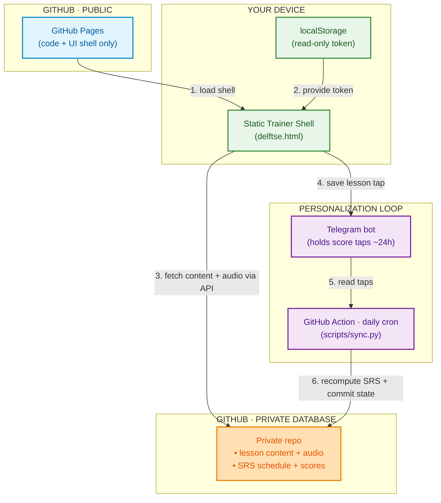

# LearnX-Delftse

An interactive, audio-first Dutch trainer (Delft-method style: listen → repeat →
fill-in → review) with spaced repetition. **This repo holds only the code and the
static trainer shell.** The lesson content and your learning state live in a separate
**private repo that acts as the database**, and the trainer fetches them at runtime
through the GitHub API using a **read-only token** — so the page is hosted publicly,
but the content and your progress stay private behind your login.

## How it works

Two repositories, clean separation:

- **This (public) repo** — the Python pipeline (`delftse/`), the tooling (`scripts/`),
  and the trainer page (`trainer/delftse.html`). Served by **GitHub Pages**. It ships
  *no* content — open it and you get a login box, nothing else.
- **A private repo (the database)** — holds the lesson data, the audio, and the learner
  state (spaced-repetition schedule + scores). Not web-listable, not on Pages.

The trainer is a static page. On load it asks for a read-only fine-grained token (kept
only in the browser's `localStorage`). Every lesson, audio file, and score is then
pulled from the private repo via `GET /repos/<owner>/<state-repo>/contents/...` with
`Authorization: Bearer <token>`. No token → nothing loads. The token *is* the login.

## Data flow



**Read path** (1–3): the public shell authenticates with your token and streams the
lessons/audio/scores from the private database.

**Personalization loop** (4–6): finishing a lesson sends a one-tap result to a Telegram
bot. The bot retains it (~24 h). A **daily GitHub Action** runs `scripts/sync.py`, which
reads the taps, folds them into the spaced-repetition schedule, and **republishes** the
"what's due" list and the scorecard back into the private repo — which the trainer reads
on its next open.

## The GitHub Action / cron

There is **no lesson generation on a schedule** — the curriculum is fixed and built once.
The cron does only the personalization sync, which takes seconds:

- **Schedule:** once a day (cron), plus a manual "Run workflow" button.
- **Steps:** check out the database (private repo) + the code (this repo) → run
  `scripts/sync.py` → commit the updated state back to the private repo.
- **Secrets:** the Telegram bot token, the owner chat id, and the review-token secret
  live as repo secrets on the private repo — never in code.

So your only daily action is: open the trainer, study, tap **save**. The Action keeps the
schedule and scores current automatically.

## Repo layout (code only)

- `delftse/` — the offline pipeline: `audio` (edge-tts MP3 + timestamps), `cloze`,
  `trainer` (the lesson payload), `srs` (spaced repetition), `review`, `telegram`, `llm`.
- `scripts/` — `convert` / `batch` (build lessons), `qc` (quality check), `sync` (the
  personalization runner the Action calls).
- `trainer/delftse.html` — the static, token-gated trainer.
- `config.py`, `.env.example`, `requirements.txt`.

## Local development

```sh
pip install -r requirements.txt        # also needs ffmpeg on PATH for audio builds
cp .env.example .env                    # fill in the keys you need
```

Building lessons needs an LLM key + edge-tts; the personalization sync needs the Telegram
keys. The trainer itself is just a static page — serve `trainer/` and open `delftse.html`
(it will prompt for your token to load content from the private database).