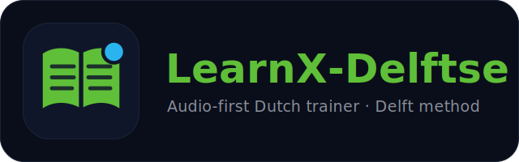

<p align="center">
  
</p>

<h1 align="center">LearnX-Delftse</h1>

https://github.com/user-attachments/assets/a9245661-52c4-4481-bca2-8e88a741b77f


An audio-first Dutch trainer in the **Delft method** style: listen → repeat →
fill in → review. You study a lesson, test yourself, and the app remembers what
you got wrong so it can bring those words back at the right time (spaced
repetition). Your progress is private and synced to you on Telegram.

> **Scope, by design:** this is a *personal, single-user* tool — one learner, one
> Telegram chat, one private data repo. The zero-backend architecture (static page
> + GitHub Action + Telegram deep links) is chosen for exactly that scale.

## How to use it

1. **Open the trainer** and log in (see [Logging in](#logging-in) below).
2. **Pick a lesson** and work through the steps. Each chapter opens on the
   **overzicht** (🗺 step 0): a one-minute skim of the word list and the whole
   dialogue, so you see the shape of the chapter before the detail work. Then
   listen to the audio, repeat, and do the exercises — the **gatentekst**
   (fill-in), the **luistertoets** (listening), and the **dictee** (type what
   you hear).
3. **Score each exercise.** You'll see how many you got right out of the total.
   Then consolidate in the **✏️ schrijven** tab: write your own sentence with
   each target word — the words you just missed are sorted to the top. Your
   sentences are saved on the device, and you can hear them read back in Dutch.
4. **Tap “✅ Resultaten opslaan”** (Save results). This sends your score to the
   Telegram bot in one tap — no typing, no account setup.
5. **Get your summary on Telegram.** Once a day (or whenever the sync runs) you
   receive a message like:

   > **📘 Delftse — daily sync**
   > **Lesson 1**: 48/49 correct · 1 wrong · 0 blank
   > ❌ Wrong: 06
   > 🔁 0 due to review · 🔥 streak 1

That’s the whole loop: **study → save → see your results**. Come back the next
day and the words you missed will be waiting in your review tab.

## Logging in

The trainer is a public page, but your lessons and progress live in a **private**
repo. To unlock them you paste a personal **GitHub token** once — that token is
your login. It’s stored only in your browser (this device), never on a server.

**Get a token (one time):**

1. On GitHub, go to **Settings → Developer settings → Personal access tokens →
   Fine-grained tokens → Generate new token**.
2. Under **Repository access**, choose **Only select repositories** and pick your
   private data repo (`LearnX-Delftse-state`).
3. Under **Permissions → Repository permissions**, set **Contents** to
   **Read-only**. (That’s all it needs.)
4. Click **Generate token** and copy it.

**Log in:** open the trainer, paste the token into the login box, and click
**Inloggen** (Log in). Done — the lessons load. If the token ever expires, just
generate a new one and paste it again.

## Understanding your results

Each test sorts every answer into three buckets:

- **correct** — you typed it right.
- **wrong** — you typed something, but it didn’t match.
- **blank** — you left it empty (this is *not* counted as wrong, and it doesn’t
  hurt your schedule).

The `❌ Wrong:` line names the words you missed, so you know exactly what to
review.

## “tracked” and “due to review”

These two numbers are your spaced-repetition progress:

- **Do a lesson test and get words right or wrong (not blank) → they enter
  tracking.** A blank or an untouched word is never tracked.
- **“tracked”** = how many vocab words are in your review rotation.
- **“due to review”** = how many of those are scheduled for *today*.

When you first learn a word it gets scheduled for tomorrow; get it right again
and the gap widens (2 days, then longer). Miss it and it comes back sooner. So
`due` is usually 0 right after studying and grows as words come back around.

## Your daily routine

Open the trainer, study a lesson, tap **save**. That’s it — a sync runs once a
day and keeps your review list and scorecard up to date automatically.

## Make a lesson from a YouTube video 🎬

Any **Dutch-language** YouTube video can become a full chapter — immersion
material: you learn how Dutch speakers actually say things.

```sh
python scripts/youtube.py "https://www.youtube.com/watch?v=..."
```

What it does:

1. Downloads the video’s Dutch subtitles (uploader-provided when available,
   YouTube’s auto-generated ones otherwise). Videos without any Dutch track are
   rejected — this pipeline is immersion-only, so the text must be real Dutch.
2. Cleans the transcript and has the LLM shape it into a book-style chapter:
   ~20 rows of the speaker’s **own words** (punctuation restored, *not*
   simplified), an English gloss per row, and 6–8 comprehension questions.
   The chapter markdown lands in `youtube/` — skim it (ASR subtitles can carry
   the odd misheard word), edit if needed, and re-run
   `python scripts/convert.py youtube/<file>.md` after edits.
3. Runs the normal converter: vocab extraction, two-voice edge-tts audio with
   the Delft repeat-pauses, gatentekst, luistertoets, dictee, vragen — and
   registers it in `index.json`.

YouTube chapters are numbered **101 and up**, so they never collide with the
book (1–43). They behave exactly like book chapters everywhere: scores, the
Telegram report, and spaced repetition all just work.

Needs an LLM key in `.env` (see below) and `yt-dlp` (in `requirements.txt`).

## Setup (only if you’re running your own copy)

**You need two repositories:**

1. **A public repo** (this one) — the app. It hosts the trainer page on **GitHub
   Pages** and runs no content of its own.
2. **A private repo** (e.g. `LearnX-Delftse-state`) — your database. It holds the
   lesson files, audio, and your progress. Keep it private.

**Connect them:**

- The trainer reads the private repo at runtime using the read-only token you
  paste in at login (see [Logging in](#logging-in)). Point the trainer at your
  private repo by setting the `owner`/`repo` values near the top of
  `trainer/delftse.html`.
- **The daily sync** is a GitHub Action in the **private** repo. It reads your
  Telegram taps, updates your spaced-repetition schedule, and writes your review
  list + scorecard back. Add these as **repo secrets on the private repo**
  (Settings → Secrets and variables → Actions):
  - `TELEGRAM_BOT_TOKEN` — from [@BotFather](https://t.me/BotFather)
  - `TELEGRAM_CHAT_ID` — your own numeric chat id (the sync only accepts taps
    from this chat)
  - `REVIEW_TOKEN_SECRET` — any long random string, kept stable

**Build / develop locally:**

```sh
pip install -r requirements.txt    # ffmpeg on PATH is needed only for building audio
cp .env.example .env               # fill in your keys (see .env.example)
python -m pytest tests/ -q        # unit tests (spaced-repetition scheduling)
```

Generating new lessons needs an LLM key; running the trainer and the sync only
needs the Telegram keys above. The trainer itself is just a static page — the
rest is internal plumbing.

**Preview a lesson locally** (before pushing it to the private repo): serve the
`trainer/` folder and open it — on `localhost` the page reads the files next to
it and skips the token login.

```sh
cd trainer
python -m http.server 8321     # then open http://localhost:8321/delftse.html
```